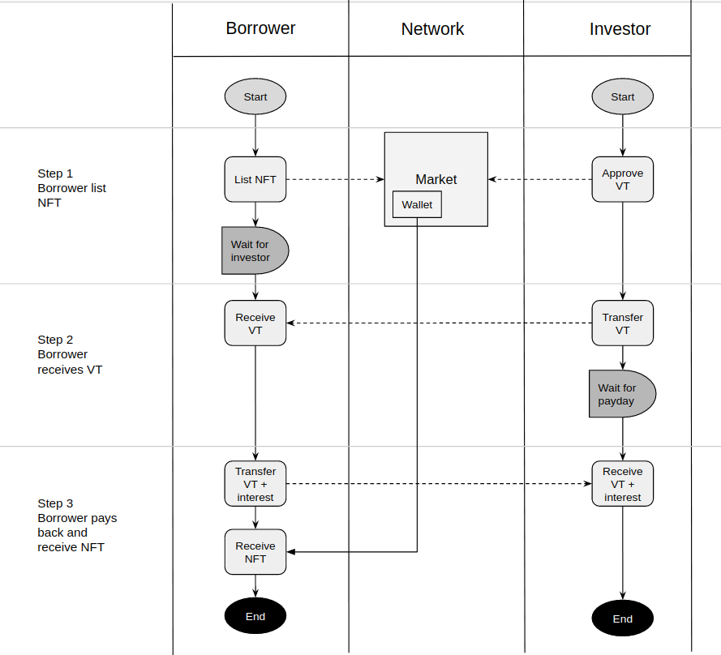

# Definiciones

Algunos términos utilizados en la documentación pueden resultar desconocidos para los desarrolladores. A continuación, enumeramos algunos términos comunes que ayudarán a comprenderlo.&#x20;

Si necesita ayuda para el desarrollo, únete al canal #developers en nuestra comunidad [Discord](https://vera.financial/discord).

| **Termino** | Descripción                                                                                                                                                                                                                                   |
| ----------- | --------------------------------------------------------------------------------------------------------------------------------------------------------------------------------------------------------------------------------------------- |
| NFT         | Los tokens no fungibles son activos digitales únicos que no se pueden clonar ni reemplazar. Su cadena de custodia se puede verificar en una cadena de bloques.                                                                                |
| APY         | Rendimiento porcentual anual, que es el rendimiento / interés después de un año, que incluye el interés compuesto. Tenga en cuenta que esto es diferente de la tasa de porcentaje anual (APR), que no tiene en cuenta los efectos compuestos. |

## Préstamo

**Roles**

**Inversor:** El usuario que proporciona fondos como préstamo a otros y obtiene intereses. **Prestatario:** el usuario que pone activos NFT como un clasificador y toma un préstamo de fondo a cambio y paga intereses.

## Arrendamiento

**Roles**

**Inversor:** propietario de NFT, que quiere arrendar sus activos.&#x20;

**Arrendatario:** el usuario que alquila activos.

