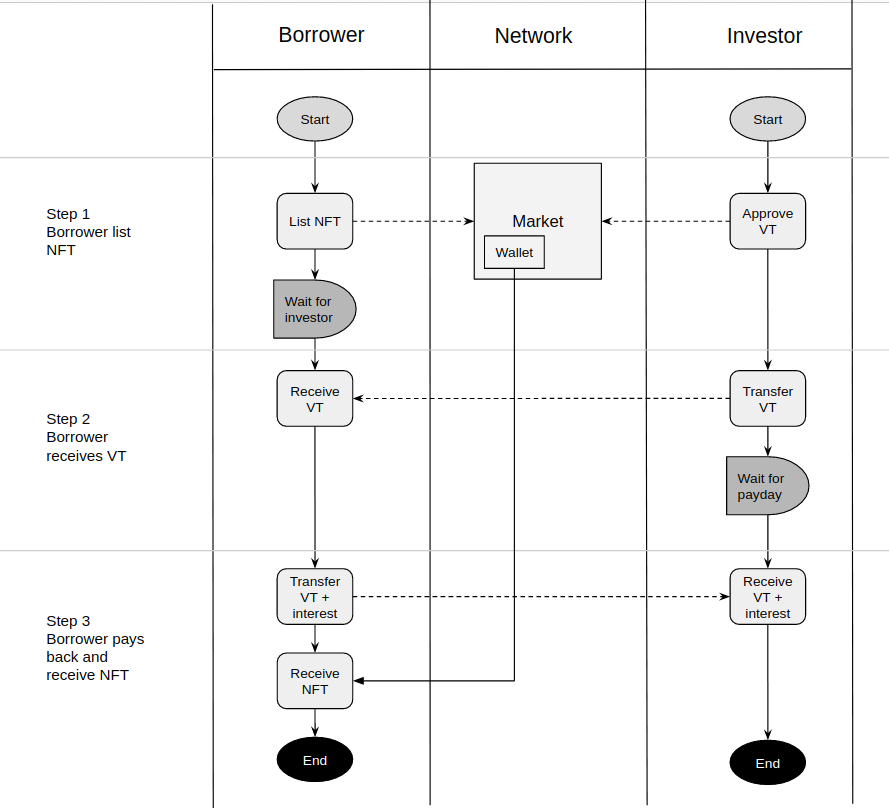

# Definitions

## Lending

**Roles**

**Investor:** The user who provides funds as a loan to others, and gets interest.  
**Borrower:** The user who puts NFT assets as a collator and takes a fund loan in exchange and pays interest.

## Leasing

**Roles**

**Investor:** Owner of NFT, who want to lease out their assets  
**Renter:** The user who rent assets.

