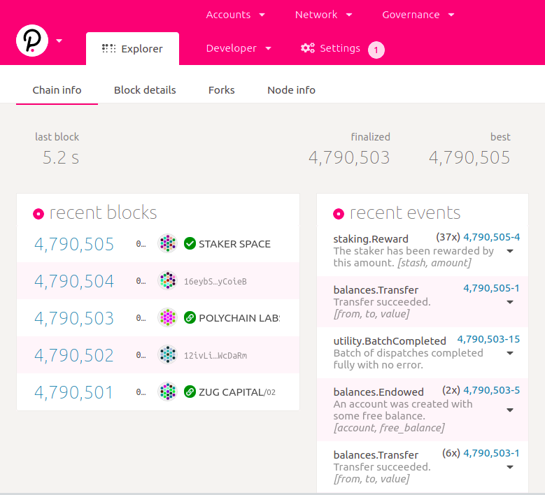
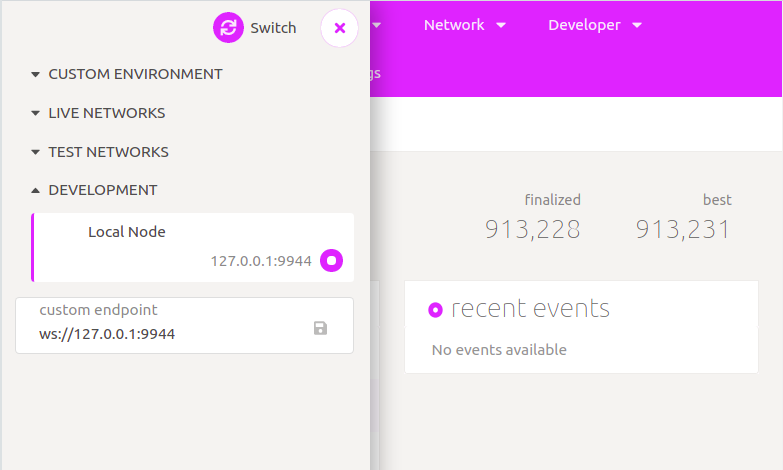

# Interact With The Node

## Connecting Polkadot JS

### 1. Open Polkadot UI App

You can use the [**Polkadot dashboard app**](http://sandbox.vera.financial/) ****which is deployed on our server to help interact with the Substrate node.



You will see something like this if it's connected to Polkadot live network.

### 2. Connect To Our Node

Click on development and choose a local node and click on switch.


The local node provides two RPC endpoints:

* HTTP: `http://127.0.0.1:9933`
* WS: `ws://127.0.0.1:9944`


With Polkadot JS Apps connected, you will see our node producing blocks.

